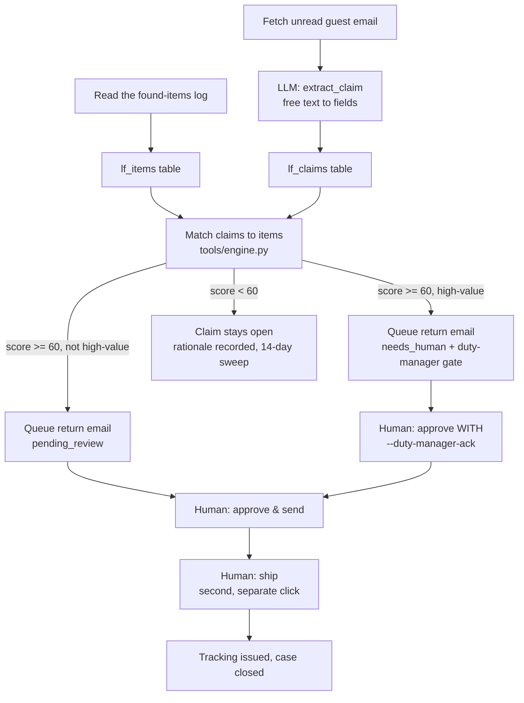

# Lost & Found AI — "The Finder"

Logs found items with photos, matches inbound guest claims to the log,
handles the guest conversation, arranges paid return shipping with a
courier, and closes the case with tracking.

Clone this repo, open Claude Code in it, and your own Claude sets it up and
runs it for your property. It knows nothing about who built it - everything
it needs is in this repo.

## What it does, what it won't, and why it matters

**Does.** "Logs found items with photos, matches inbound guest claims to the
log, handles the guest conversation, arranges paid return shipping with a
courier, and closes the case with tracking."

**Won't.** "High-value items (passports, jewellery) route to the duty
manager before anything ships." This is not a limitation - it is the one
guardrail this agent exists to get right, and it is enforced in code, not
just written in a doc. See "Guardrails & safety" below.

**Why it matters.** "Lost & found is a daily trickle of emails and calls
nobody owns, and slow handling sours an otherwise great stay."

**What to expect.** "Every found item logged and every claim matched,
answered, and shipped without staff chasing couriers."

**ROI.** −90% Lost & found admin time (labor) - the roster's own number.
Your property's actual saving depends on volume and on the found-items log
actually being kept current; see `docs/benefits.md` for what to measure
instead of taking this on faith.

## Who it's for

Any hotel, guesthouse, or short-term-rental operation where lost & found
handling today means a housekeeping notebook, a lost-property drawer, and an
inbox folder nobody is responsible for. It works with a found-items log as
simple as a spreadsheet - you do not need a housekeeping app or a PMS
integration to start.

Properties that see the most benefit have real footfall through communal
spaces (bars, pools, gyms, breakfast rooms) where guests actually leave
things behind, and a mailbox guests already write to when something goes
missing. A five-room guesthouse will see less volume than a 200-room resort,
but the same time saved per case - reading an email, checking a drawer,
writing a reply - is the thing this agent removes either way.

## How it works

One pass, four stages, all deterministic except one small language step:



**Deterministic decisioning, LLM for language.** The matcher never calls a
model - `tools/engine.py` is pure functions scoring evidence (item category,
distinguishing details, place, date) with every point named and logged. The
**one** LLM call in this agent turns a guest's free-text email into the
structured fields the matcher needs (`prompts/extract_claim.md`). Full
detail, the confusable-family veto, and every design decision taken where
the source spec was silent: `docs/how-it-works.md`.

**Modes.** `mode: shadow` (the default) drafts and queues everything, sends
nothing. `mode: live` lets an approved item actually send - never an
unapproved one, and never a high-value one without the duty manager's name.
See "Go live" below.

**The review loop.** A confident match becomes a drafted return email
waiting for a human (`pending_review`, or `needs_human` if it is
high-value). Approving queues it to send; shipping - issuing a tracking
number and closing the case - is a deliberate **second** click, never
combined with sending the email. See "Guardrails & safety" and
`workflows/80-review.md`.

**What runs when.**

| Workflow | Cadence | What it touches |
|---|---|---|
| `workflows/10-match-claims.md` (`tools/run.py --once`) | every 30-60 minutes, or on demand | reads the found-items log and unread email; one LLM call per new email |
| `workflows/80-review.md` (`tools/review.py`) | whenever a human is free | local only - no external calls until you approve something |
| Sending (`tools/review.py send`) | after you approve | your mailbox |
| Shipping (`tools/review.py ship`) | after the guest confirms | best-effort courier-log write + staff ping; no real courier is called |

**Sub-agents.** None - this is one self-contained loop. `docs/sub-agents.md`
says so plainly.

## What you need

To try the demo below: nothing but Python 3.11+.

To run it for real:

- **A found-items log.** A CSV export (`data/imports/found_items.csv`, works
  with any spreadsheet) or a Google Sheet. Whatever housekeeping already uses
  to note down what was handed in.
- **A guest mailbox** the property already uses for lost & found questions,
  or is willing to point this agent at (IMAP works with any provider; a
  built Gmail connector is also included).
- **A way to think.** Your own Claude Code subscription (`interactive` or
  `claude-code` provider - the interactive one costs nothing extra and is the
  best way to see how the agent reasons) or your own Anthropic API key
  (`anthropic` provider, for volume).
- **A duty manager who will actually pick up the phone.** The one guardrail
  this agent cannot substitute for is a person who looks at a jewellery or
  passport match before it ships.
- Optional: a WhatsApp number or a webhook, if you want the duty-manager
  ping to go somewhere other than the review queue.

Setup end to end, including filling in your property's own facts, is about
30-60 minutes the first time.

## Quick start (5 minutes, no credentials)

```bash
git clone https://github.com/th1-ai/lost-found-ai.git lost-found-ai
cd lost-found-ai
make setup
make demo
```

`make setup` creates a virtualenv, installs the (tiny) dependency list, and
copies the example config files. `make demo` runs the whole loop against the
bundled sample hotel - 10 found items, 6 sample guest emails - with the
`mock` provider, so nothing leaves your machine and nothing needs a
credential. Expect something close to this:

```
Lost & Found AI demo - fixtures/hotel/found_items.csv + fixtures/inbound/*.json

Found-items log: 10 item(s) logged from the floor sheet (3 high-value - flagged
for the duty manager the moment they were logged, before any claim exists).
Guest email: 6 message(s) read, 6 turned into a claim by the one LLM call this
agent makes (0 were not actually a lost-item claim).

  - Reading 6 open claim(s) against 10 logged items
    60 pairs scored on item class, distinguishing detail, place and date — no
    free-text guessing
  - Scoring the distinguishing details, not just the noun
    claim-claim-01-bracelet: Matching detail: silver, anchor, charm · ...
  - Rejecting 1 near-miss(es) on purpose
    claim-claim-02-eyewear-trap vs fi-02: The only eyewear handed in is
    "Sunglasses, tortoiseshell frame" from lobby. The guest describes reading
    glasses in a red case — sunglasses are a different thing entirely...
  - 3 confident match(es), 3 left open
    Return emails drafted for the 3 match(es) — nothing ships until a human
    approves it, and high-value items always route to the duty manager first

3 of 6 claims matched to a logged item.
3 return email(s) queued for a human to approve, 3 of those are high-value and
need the duty manager's sign-off before they can be approved (docs/safety.md).

Nothing was sent and nothing shipped: mode is shadow, and demo never approves
anything on its own.
Next: `make review` to see the drafts, or read workflows/10-match-claims.md.

DEMO OK — 16 items processed, 3 drafted, 0 sent (shadow)
```

Three of the six sample claims land on high-value items on purpose (a
bracelet, an earring, a passport) - it is the clearest way to see the duty
manager gate working the very first time you run this. One claim (reading
glasses vs. the only sunglasses on the log) demonstrates the confusable-family
veto: the deliberate refusal to guess. The other two stay open with an honest
"nothing similar in the log."

Then run `make doctor`. Expect a `FAIL` on "hotel identity" (the property is
still the shipped placeholder, "Hotel Aurora") and a handful of `warn` lines -
that is the intended state of a fresh clone. `workflows/00-setup.md` walks
through filling in the real property.

## Set up with Claude Code

Open `claude` in this folder and work through these prompts one at a time -
each one names the workflow file Claude will actually follow.

**Phase 1 - set up.**

> Read `workflows/00-setup.md` and walk me through it. I run [your hotel
> name] in [city, country]. Help me fill in `config/hotel.yaml` and the
> `knowledge/` files, then run `make doctor` and tell me what is left.

**Phase 2 - run it for real.**

> Read `workflows/10-match-claims.md`. Run one real pass with `make run` and
> tell me in plain language what it found - new items logged, new claims,
> any confident matches, and anything that needs the duty manager.

**Phase 3 - work the review queue.**

> Read `workflows/80-review.md`. Show me what is waiting with `make review`,
> read each one back to me, and act on what I decide - approve, edit, reject,
> send, or ship. Never send or ship anything without telling me first.

**Phase 4 - go live (when you are ready, not before).**

> Read `workflows/90-go-live.md` and check the list against where we actually
> are. Do not change `mode` to `live` until every box is genuinely checked,
> and tell me plainly what changes when you do.

If anything breaks along the way: `workflows/99-troubleshooting.md` covers
the common cases.

## Connect your systems

Every connector here is one of three things, and `docs/integrations.md`
says which for each: **built** (a real API, tested against it), **universal**
(works with any system - CSV export, IMAP, a webhook), or **stub** (interface
only, not implemented). This agent uses:

| System | What it's for | Start here |
|---|---|---|
| Email (`systems.email.adapter`) | reads guest claim emails, sends return emails | `imap` (universal - works with any provider) |
| Sheets (`systems.sheets.adapter`) | reads the found-items log, writes a best-effort courier log | `csv` (universal - `data/imports/found_items.csv`) |
| Messaging (`systems.messaging.adapter`) | optional: pings the duty manager for high-value items and the 14-day sweep | `webhook` (universal) or `unipile` (your own WhatsApp) |

**This agent does not read or write your PMS at all.** `pms` is part of the
shared runtime every repo in this family carries, so `make doctor` checks it
regardless - leave `systems.pms.adapter: mock` in `config/hotel.yaml` and
ignore that line.

**Courier is a stub, honestly.** "Arranges paid return shipping with a
courier ... closes the case with tracking" is simulated today:
`tools/review.py ship` generates its own tracking number and neither buys a
real shipping label nor calls a real carrier. `core.adapters.get_stub("courier",
settings)` exists as an interface to build against
(the `Courier` class in `core/adapters/base.py`) but nothing here calls it yet. See
`docs/integrations.md` for exactly what a real integration would need.

Check what is actually working on your machine at any time:

```bash
make doctor
```

## Run it

```bash
make run                          # one pass: intake + claim extraction + matching
make run ARGS="--limit 5"         # just the first five new emails
make run ARGS="--dry-run"         # compute everything, write nothing
make watch                        # loop on the configured interval until you stop it
```

If `llm.provider` is `interactive`, a run stops with exit code 3 and parks a
prompt in `data/pending/` for each new email - read it, write your answer as
JSON to the matching file, and run the same command again. That is not an
error; it is how the agent asks you instead of calling a model.

**The review queue.**

```bash
make review                                  # what is waiting
python3 tools/review.py digest                # one-line summary first
python3 tools/review.py show <id>             # the full draft and how it got there
python3 tools/review.py approve <id>
python3 tools/review.py approve <id> --duty-manager-ack "Duty manager name"
python3 tools/review.py edit <id> --body-file my-version.txt
python3 tools/review.py reject <id> --reason "wrong item"
python3 tools/review.py send                  # sends everything approved or edited
python3 tools/review.py ship <claim-id>        # second click, after the guest confirms
```

`workflows/80-review.md` covers this in full, including the digest and the
duty-manager gate.

**Scheduling.** `scheduler/` has ready-made snippets for cron (any Linux or
Mac), launchd (the right choice on a Mac that sleeps), and systemd (a Linux
server): `scheduler/crontab.example`, `scheduler/launchd.example.plist`,
`scheduler/systemd.example.service` + `scheduler/systemd.example.timer`.
Copy the one you need and replace the placeholder paths with the output of
`pwd` in this folder - each file's own header says exactly how.

**Subscription or API, honestly.** Your own Claude Code subscription
(`interactive` or `claude-code`) is the cheapest way to run a small
property's agent - a handful of scheduled passes a day is normal use. It is
not designed for a busy inbox running around the clock; read
`docs/safety.md` before you point it at high volume. The `anthropic`
provider (your own API key) is the right answer once this is part of how the
property actually runs - `make report` shows what you are spending either
way.

## Go live

`mode: shadow` is the default and stays the default until you deliberately
change it. Approving a draft in shadow mode only records that decision - it
never sends or ships, even for an approved item - so `workflows/90-go-live.md`
has you run `python3 tools/review.py stale` to clear the shadow-era backlog
right before the flip. The full checklist: real drafts reviewed, at least one
high-value match actually walked through the duty-manager gate, a real
mailbox and found-items source connected, `make doctor` clean. The short
version:

```yaml
# config/hotel.yaml
mode: live
```

Going live means an **approved** return email actually sends. It changes
nothing else: shipping is still always a separate second click, and a
high-value match still always needs a named duty-manager acknowledgement -
`mode: live` does not touch that gate at all. Go back to shadow the same way,
or for one run with `AGENT_MODE=shadow` in `.env` - either stops every
outbound action immediately, mid-schedule.

## Guardrails & safety

**What this agent will never do:**

- Send anything, or ship anything, while `mode: shadow`.
- Approve, edit, or ship a match touching jewellery or an identity document
  (passport, ID card, driving licence) without a named duty-manager
  acknowledgement - enforced in `tools/review.py`, not just documented.
- Propose a match between two things that read alike in free text but are
  never the same object (today: reading glasses vs. sunglasses) - it is
  hard-vetoed to a score of zero and the claim stays open with a written
  reason instead of a guess.
- Combine sending the return email and shipping the item into one step.
- Take a payment, issue a refund, or move money.
- Guess. A vague or unmatched claim gets an honest written reason and a
  place on the 14-day sweep, never a silent blank or a hopeful maybe.

**Escalation.** Every high-value item is flagged the moment it is logged,
before any claim even exists, and again the moment a confident match is
found - both times pinging the duty manager (`contacts.manager` in
`config/hotel.yaml`) if messaging is connected. Full detail:
`docs/safety.md`.

**Data handling.** Everything lives in `data/` inside this folder - a local
SQLite database, logs, exports. There is no cloud service behind this repo
and no telemetry. Card numbers are redacted on ingestion, always, regardless
of config (`core/redact.py`). `privacy.retention_days` in `config/hotel.yaml`
controls how long processed items stay in the database - see `docs/safety.md`
for the GDPR summary (this software runs on your machine, under your
control; your model provider, if you use one, is a processor, not TH1).

**Telling guests they are talking to AI.** The EU AI Act (Article 50)
requires people be told when they are interacting with an AI system, unless
it is obvious - and it is good practice everywhere regardless. Add a line
like this to the signature on any message this agent sends:

> This reply was prepared with AI assistance and reviewed by our team. Reply
> to this message any time to reach a person directly.

`docs/safety.md` has the full wording options and the honest
subscription-vs-API note referenced above.

## Sub-agents in this repo

None. The roster lists no children for Lost & Found AI, and the Email
Optimizer / Coach layer does not apply to it either. This is one
self-contained loop end to end - `docs/sub-agents.md` covers what to change
if you want to extend it (a real courier integration, a different intake
source) rather than fold in a child agent that does not exist here.

## Customising

- **`knowledge/lost-and-found-policy.md`** is the file that matters most for
  this agent - hold periods, who the duty manager is, which categories count
  as high-value beyond the two the roster names, and postage arrangements.
  It feeds the `extract_claim` prompt and is the source the return-email
  template quotes.
- **`knowledge/property.md`, `knowledge/faq.md`** - the general property
  facts every agent in this family reads.
- **`prompts/extract_claim.md`** - the one prompt this agent uses, plain
  markdown. Edit it directly if the model is mis-reading guest emails; the
  JSON schema it must answer against is `prompts/schemas/extract-claim.json`.
- **`config/agent.yaml`'s `lost_found` block** - `match_threshold` (60,
  raise it if near-misses keep getting queued), `confusable_families`
  (`eyewear` today - add another pair of categories that read alike but are
  never the same thing), `high_value_families` (`jewellery`, `documents` -
  add a category your property treats as high-value), `sweep_days` (14), and
  `shipping.hold_days` / `shipping.courier_note` (what the return email
  promises the guest).
- **Categories the matcher recognises** are the 12 built into
  `tools/engine.py`'s `CATEGORIES` table (a regex per category, ordered
  deliberately - a "Garmin watch charger" must classify as a charger, not a
  watch) plus anything listed in `config/agent.yaml`'s
  `lost_found.extra_categories`. Listing a category in
  `knowledge/lost-and-found-policy.md` alone only changes what the agent
  talks about; add it to `extra_categories` (an id, a family, a label and
  the keywords a guest would use) for the matcher to actually score it -
  no code edit needed. `make doctor` reports how many custom categories are
  configured.
- **Adding a language.** `hotel.languages` (`config/hotel.yaml`) already
  gates what gets drafted at all: a claim written in a language not on that
  list goes to `needs_human` instead (`tools/engine.py`'s `_language_gate`,
  using `core.i18n.detect_language`), so the matcher never guesses at a
  language it cannot serve. Once a claim passes that gate, `category_of()`
  classifies it directly in the guest's own language - the built-in
  `CATEGORIES` table carries es/fr/de/it/pt keywords alongside the English
  ones (accent-folded, so "pulseira"/"pulsèira" both match), the same five
  languages `prompts/extract_claim.md` reads, and any `extra_categories` you
  add get the same accent fold. This does not depend on the model
  translating anything: `extract_claim`'s optional `description_en` field
  (a short English gloss, when the model is confident of one) only ever
  helps the ATTRIBUTES/PLACES scoring pick up extra evidence points, it is
  never required for a category to match. **The return-email template
  itself is still a fixed English string** today (`draft_return_email` in
  `tools/engine.py`) - this agent does not wire in `core/i18n.py`'s
  templating the way some others in this family do. For a multi-language
  property, add the language to `hotel.languages` first (the matcher and
  the language gate need nothing further for es/fr/de/it/pt), then ask your
  Claude Code session to add a language branch to the reply template
  function, following the same `{{vars}}` style `core/templates.py` uses
  elsewhere - and, for any other language, add its keyword equivalents to
  `tools/engine.py`'s `CATEGORIES` the same way.
- **A manual override for a below-threshold match** does not exist on
  purpose - `docs/how-it-works.md` explains why, and what a real one would
  need to look like if a property asks for it.

## Troubleshooting & FAQ

`workflows/99-troubleshooting.md` has the full list; the ones people hit
first:

**`make doctor` shows a FAIL on "hotel identity".** Expected on a fresh
clone - the property name is still the shipped placeholder. Edit
`config/hotel.yaml`.

**`tools/review.py approve` refuses with "is high-value".** Working as
intended. Get the duty manager to actually look at the claim
(`python3 tools/review.py show <id>`), then re-run with
`--duty-manager-ack "<their name>"`. If the match itself looks wrong,
`reject` it instead of forcing the ack through.

**`tools/review.py ship` refuses with "is not 'sent' yet".** The return
email has to actually go out before the item can ship - `send` it first.

**"Why did it not match my obvious pair?"** The matcher is deliberately
conservative - it would rather leave a claim open with an honest reason than
propose a match it cannot support with real evidence (see "The
confusable-family veto" in `docs/how-it-works.md`). Check
`python3 tools/review.py show <id>` for the exact scoring reasons on a
near-miss, and consider lowering `lost_found.match_threshold` slightly if
you are seeing consistent near-misses just under 60.

**"Can this ship without a human?"** No, and this is not a config
option. Sending is always approved first; shipping is always a second,
separate click; a high-value item always needs a named duty-manager
acknowledgement. This is the roster's "cant" promise, and it holds
regardless of `mode`.

**"The found-items log is not showing up."** `make doctor`'s "found-items
intake" line says why - usually the CSV file does not exist yet, or a row is
missing an `id` or an `item` value (both required, silently skipped
otherwise).

## Measuring the benefit

```bash
make report
```

Reads `data/agent.db` and shows: how many items are logged and their status,
how many claims came in and how they resolved (matched / still open /
shipped / expired), how many high-value shipments got a duty-manager
sign-off and how many are waiting for one, the review queue's edit rate (how
often a human rewrote a draft before sending - the loop that teaches the
agent your property's voice), and LLM spend for the one model call this
agent makes. `docs/benefits.md` has the full breakdown, what each number
means for the roster's ROI claim, and the honest caveats - starting with
"the -90% figure is the roster's claim, not something this repo measures for
you automatically."

## About

Built by [TH1](https://th1.ai) as one of a family of open-source hotel
AI-agent templates - clone any of them, and your own Claude Code session
sets it up and runs it, on your own systems and your own subscription or API
key. Licence: MIT (`LICENSE`). Want it run for you instead of running it
yourself? Get in touch at [th1.ai](https://th1.ai).
