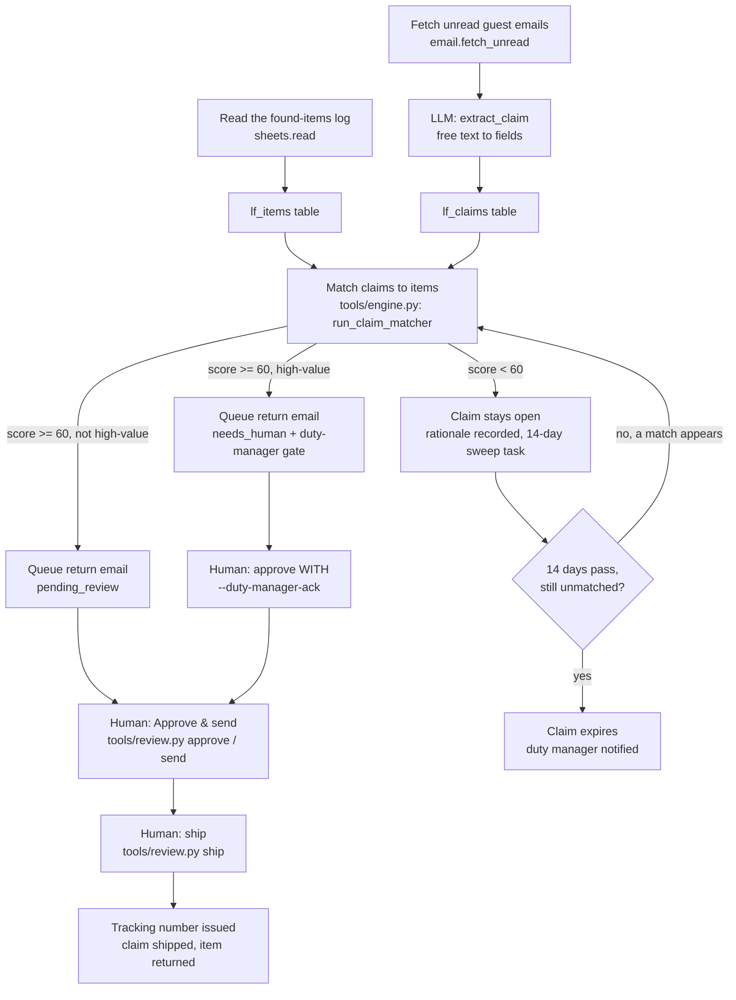

# How Lost & Found AI works

## The loop

One pass, four stages, all deterministic except one small language step:

`tools/run.py --once` runs stages A-F-G/H/I in one pass. Stage J (approve/send) and
stage L (ship) are separate human actions run from `tools/review.py`, on purpose —
nothing ships without two explicit clicks (spec: "Nothing ships without a human
approval click").

## Deterministic decisioning, LLM for language

The matcher itself never calls a model. `tools/engine.py` is pure functions over
dataclasses: `category_of`, `score_pair`, `run_claim_matcher`. Every score is a sum
of named, logged reasons ("category match +45, matching detail: silver, anchor,
charm +45, found at the bar — the guest points at the same place +10, logged 2 days
ago, matching the checkout date +8 → 108, capped at 96"). That is deliberate: this
agent's whole value is refusing a plausible-looking match rather than guessing, and
a black-box score would defeat the point.

The **one** LLM call in this agent is `extract_claim` (`prompts/extract_claim.md`):
turning a guest's free-text email into the structured fields the matcher needs
(`guest_name`, `contact`, `description`, `stay_note`). This is not in the source
spec — the demo's claims arrive pre-structured in the database. A real inbox gets
free text, so something has to parse it, and that is exactly the kind of "classify
free text, don't decide anything" job core/llm.py exists for. If the model flags
`needs_human: true` (the email is not actually a lost-item claim — spam, a booking
question that landed in the wrong inbox) the item queues straight to `needs_human`
and never reaches the matcher.

## The confusable-family veto

`CATEGORIES` groups similar-but-different things into a `family`
(`sunglasses` and `reading glasses` are both `eyewear`). `CONFUSABLE_FAMILIES`
(just `eyewear` today) is the set of families where two different categories read
alike in free text but are never the same physical object. When a claim and an
item land in the same confusable family but different categories, the match is
**hard-vetoed to score 0** — no partial credit, no "maybe" — and the veto text
names the one logged item, quotes the guest's own words, and says plainly that
posting the wrong pair is worse than an honest "not yet." This is the deliberate
trap case from the spec (tortoiseshell reading glasses vs. the only eyewear on
the log, a pair of sunglasses) and it is what "conservative, evidence-scored"
means in practice: the algorithm's job is not to find *a* match, it is to refuse
one it cannot support.

## Design decisions (spec was silent or explicitly unbuilt)

The behavioural spec (`specs/lost-found-ai.md` in the factory) flags several
things as "not specified in demo" or "entirely unbuilt." Decisions taken here:

1. **The high-value escalation ("passports, jewellery... route to the duty
   manager") is built, not just documented.** The demo scores jewellery like any
   other category (spec §11, open question 1). Here, `HIGH_VALUE_FAMILIES =
   {jewellery, documents}` (a `documents` category was added — passports, ID
   cards, driving licences — since the roster names passports explicitly and the
   demo's category table has nothing for them). Any match touching a high-value
   family is forced to `needs_human` regardless of score, and
   `tools/review.py approve` refuses it outright unless called with
   `--duty-manager-ack "<name>"`. A high-value item is also flagged the moment
   it is logged, before any claim exists, so the duty manager knows what is in
   the safe. This is enforced in code (`tools/engine.py:is_high_value`,
   `tools/review.py:cmd_approve`), not just written in a doc — it is the one
   guardrail the roster's "cant" promise is actually about.
2. **Found-item intake uses the Sheets adapter, not a new system.** The spec
   notes "the demo's items are seeded, not derived from a live intake form"
   (§5). There is no PMS-style "found item" system to port, so intake reads a
   `found_items` sheet (`systems.sheets.adapter`: `csv` by default — a file
   at `data/imports/found_items.csv` staff maintain, or a Google Sheet tab).
   Any hotel spreadsheet or housekeeping app that can export a CSV works.
3. **"Handles the guest conversation" stays a single templated email, on
   purpose.** The spec is explicit that the demo drafts one email and stops
   (§11, open question 3) — no thread, no LLM conversation. Building a full
   back-and-forth was out of scope for what the roster promises today
   (`does` describes drafting and shipping, not a multi-turn chat), so
   `draft_return_email` stays a pure Python template, matching the spec's own
   framing of this as "deliberately LLM-free." A real thread reply (the guest
   writing back to confirm the shipping address) is a natural next step, noted
   under Customising.
4. **Courier and tracking are simulated, honestly labelled as such.** The spec
   is explicit that the demo has no real shipping-label API and no tracking
   field (§11, open question 4). `core/adapters/base.py` does have a `Courier`
   stub family now (`core.adapters.get_stub("courier", settings)`, alongside
   `pos`, `accounting`, `reviews`, `calendar`, `payments`, `procurement`,
   `locks`) — but nothing in this repo calls it yet.
   `tools/engine.py:ship_claim` generates its own tracking id from
   `store.next_sequence("courier_tracking")` (never on `--dry-run`) and
   records it on the claim. `docs/integrations.md` and the README are
   explicit: **no real courier is called.** A real integration would
   implement `Courier.track` / `Courier.create_shipment` (see
   `docs/integrations.md#implement-your-own`) and have `ship_claim` call it
   instead of minting its own tracking id.
5. **A 14-day sweep, using the store's tickler table.** The spec says an
   unmatched claim "goes on the 14-day sweep" (§3 step 7) but the demo has no
   time-based re-check — every claim is re-scored on every manual run only.
   Here, an unmatched claim gets a `core.store` task (`kind="lf_sweep"`,
   `next_action_due` = +14 days). Every pass re-scores every open claim
   anyway (so a match found on day 3 closes the task early); a task that
   comes due still unmatched expires the claim and pings the duty manager
   instead of leaving it open forever silently.
6. **No manual override to force a below-threshold match.** The spec notes
   this gap (§11, open question 5) and does not ask for it to be fixed. It
   stays unbuilt here too: a human can approve a proposed match or leave a
   claim open, never hand-pick a pairing the algorithm scored below 60. If a
   hotel wants this, `docs/integrations.md` is not the place — it is a
   `tools/review.py` change, and it should keep the same "explain the
   override in the audit trail" discipline as everything else in `core.store`.
7. **Agent tables are added with `store.migrate(sql)`.** `tools/engine.py:
   ensure_schema` calls `store.migrate(LF_SCHEMA)` — `core/store.py`'s own
   helper for exactly this, run once right after `Store(settings)`, same as
   every other agent in this family.
8. **A claim in a language `hotel.languages` does not list never gets a
   drafted reply.** `tools/engine.py:_language_gate` runs
   `core.i18n.detect_language` on the guest's own text (a stopword vote, no
   extra model call) before the one paid LLM call, not after — a guest
   writing in a language this property does not support goes straight to
   `needs_human` with the reason `"guest wrote in <lang>, not in hotel.
   languages"` and the property's own default language (`hotel.languages[0]`)
   recorded alongside it, and `extract_claim` never even runs for that email.
   The return-email template itself is still fixed English regardless (see
   "Adding a language" in the README) - this gate only stops a language the
   property cannot serve from reaching a draft at all.

## Idempotency

- **Found items**: `lf_items` is keyed on the sheet row's own `id`
  (`INSERT OR IGNORE`); re-reading the same sheet twice never duplicates a row.
- **Claims**: `store.already_processed("email", ids)` skips emails already
  ingested, same as the reference agent; `lf_claims.source_email_id` is unique.
- **Matches**: the return-email FSM item is keyed on `(source="lost_found",
  external_id="<claim_id>:m<N>")` - one row per match *attempt*
  (`store.next_sequence`), not one row per claim. A claim only re-enters the
  matcher while it is `open`: either its first-ever match, or after a human
  `reject` puts it back in the pool (`workflows/80-review.md`). So
  re-running the matcher while a claim is already `matched` is still a
  no-op (it is no longer in the `open` pool - `store.upsert_item` is never
  even called for it), but a genuine re-match after a rejection always gets
  a brand-new row, never the old terminal `rejected` one. This is the fix
  for SIMULATION.md round 2, new finding B: keying purely on `claim_id` made
  `store.upsert_item` return the OLD row untouched on a re-match, regardless
  of its (terminal) `review_status`, so the claim silently had no reviewable
  item ever again. `ship_claim` looks up the *latest* attempt for a claim
  (`_active_return_item`, `tools/engine.py`), not a fixed external_id.
- **Sends**: `store.claim_for_send()` — a single conditional UPDATE — so two
  runners can never both send the same return email.
- **Tracking numbers**: `store.next_sequence("courier_tracking")` is
  transactional and is never incremented on `--dry-run`, so a rehearsal cannot
  burn a tracking number.
- **Sweep tasks**: `store.upsert_task(kind="lf_sweep", ref_id=claim_id, ...)`
  is keyed on `(kind, ref_id)`, so re-running the matcher never creates a
  second sweep task for the same claim.
- **`--dry-run`**: `tools/run.py:one_pass` snapshots the whole database to
  memory before the pass and restores it afterwards, whatever happened in
  between (`sqlite3`'s online backup API - a plain transaction does not hold
  here, because `ensure_schema`/`migrate` use `executescript()`, which
  silently commits any open one). Nothing from a `--dry-run` pass - not a
  logged item, not a claim, not a run row - is still there afterwards, so
  running it twice in a row is always identical and never an
  `IntegrityError`.

## What runs when

| Workflow | Cadence | Provider used |
|---|---|---|
| `workflows/10-match-claims.md` (`tools/run.py --once`) | every 30-60 min, or on demand | `email` (fetch), `sheets` (read found items), one `extract_claim` LLM call per new email |
| `workflows/80-review.md` (`tools/review.py`) | whenever a human is free | none (local reads/writes) |
| Shipping (`tools/review.py ship`) | after a guest confirms | `sheets` (courier log, best-effort), `messaging` (staff notify, best-effort) |

## No sub-agents, no coach

This is a single self-contained loop. The roster lists no children for Lost &
Found AI and the Email Optimizer / Coach layer does not apply to it.
Everything above is the whole agent.
